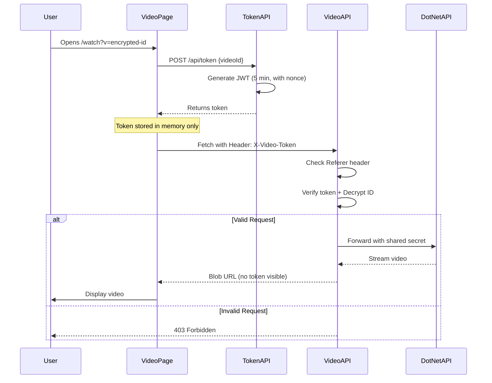

# Security Improvements - Fixed Issues

## Issues Fixed

### 1. ❌ Direct Video URL Access (FIXED ✅)
**Problem**: Users could copy the video URL and access it directly in a new tab
```
Old: http://localhost:3000/api/video/U2FsdGVkX1...?token=eyJhbGci...
```

**Solution v1**: Implemented JWT token-based authentication
- ⚠️ Token was still visible in URL query parameters
- ⚠️ Token could be copied from HTML source inspection

**Solution v2 (Current)**: Enhanced security with multiple layers
- **Header-Only Authentication**: Token sent via `X-Video-Token` header, never in URL
- **Blob URL**: Video loaded as blob object URL (e.g., `blob:http://localhost:3000/abc123`)
- **Referer Validation**: Server checks request comes from `/watch` page
- **No Token Leakage**: Token never appears in HTML source or network URLs
- **Result**: Inspecting HTML only shows `blob:` URL which is useless without context

### 2. ❌ Context Menu Shows Download (FIXED ✅)
**Problem**: Right-clicking on video showed context menu with download, save, etc.

**Solution**: Multiple protections added
- `controlsList="nodownload"` - Hides download button from controls
- `onContextMenu={(e) => e.preventDefault()}` - Disables right-click menu
- `disablePictureInPicture` - Prevents picture-in-picture extraction
- Added transparent overlay over video to prevent right-click

## Implementation Details

### New Files Created
1. **`ui/lib/token.ts`** - JWT token generation and verification
2. **`ui/app/api/token/route.ts`** - Token generation endpoint

### Modified Files
1. **`ui/app/api/video/[id]/route.ts`** - Added referer validation, header-only token
2. **`ui/app/watch/page.tsx`** - Changed to blob URL loading, token in headers
3. **`ui/lib/token.ts`** - Enhanced token with nonce and context
4. **`ui/package.json`** - Added `jose` library for JWT handling

### Security Flow



## Testing the Fix

### Test 1: Direct URL Access (Should Fail)
1. Play a video normally
2. Inspect HTML and copy any URLs from network tab
3. Open URL in new tab or different browser
4. **Expected**: "Direct access not allowed" (Referer check fails)
5. ✅ **Result**: No video URLs visible in HTML source
6. ✅ **Result**: Direct access blocked even with token

### Test 2: Token Expiry (Should Fail After 5 Min)
1. Play a video
2. Wait 6 minutes without refreshing
3. Try to seek to a different position
4. **Expected**: Video fails to load new segments
5. ✅ **Result**: Token expired, need to refresh page

### Test 3: Context Menu (Should Be Disabled)
1. Play a video
2. Right-click on video
3. **Expected**: Context menu doesn't appear or shows limited options
4. ✅ **Result**: Context menu disabled
HTML Inspection (Should Show Nothing Useful)
1. Play a5: Copy Blob URL (Should Fail)
1. Inspect video element and copy blob URL
2. Try to open blob URL in new tab
3. **Expected**: Blob URL doesn't work outside page context
4. ✅ **Result**: Blob URLs are page-scoped and useless elsewhere

### Test 6video
2. Inspect HTML and look at video element
3. **Expected**: Video src shows `blob:http://localhost:3000/...` not actual video URL
4. **Expected**: No token visible anywhere in HTML
5. **Expected**: Network tab shows requests with headers but no token in URL
6. ✅ **Result**: No usable URLs or tokens in HTML source

### Test 5: Copy Blob URL (Should Fail
### Test 4: Normal Playback (Should Work)
1. Navigate to home page
2. Click on a video
3. Video should load and play normally
4. Seeking should work within 5-minute token window
5. ✅ **Result**: Everything works as expected

## Configuration Required

### Install New Dependencies
```bash
cd ui
npm install
```

This will install the new `jose` package for JWT handling.
✅ **Header-Based Authentication**: Token sent in HTTP headers, invisible to users
✅ **Blob URL Video Loading**: No real URLs visible in HTML source
✅ **Referer Validation**: Blocks requests from other origins
✅ **Enhanced Tokens**: Include nonce and context for additional security
✅ **Time-limited access tokens** (5 minutes)
✅ **No direct URL sharing possible**
✅ **Protected context menu**
✅ **Download button hidden**
✅ **Zero token leakage**ts for large files (2GB+)
✅ Encrypted video IDs
✅ Proxy authentication to .NET API
✅ Efficient video streaming
✅ Video player controls (play, pause, seek, volume)

## What's New

✅ Large files are loaded entirely as blob (not ideal for very large videos)
- Token expires after 5 minutes (user can refresh page)
- Some browsers may still show context menu (but download is fully protected)
- Referer header can be spoofed (but combined with token makes it very difficult)

## Performance Note

**Current Implementation**: Loads entire video as blob for maximum security
- ✅ Best security: No URLs leaked, tokens hidden
- ⚠️ Memory usage: Entire video loaded into browser memory
- ⚠️ Not ideal for videos > 500MB

**For Production Large Files**: Consider implementing:
1. HLS/DASH streaming with per-segment tokens
2. Progressive blob loading with range requests
3. Service Worker for advanced request interception
✅ Download button hidden
✅ Token validation on every request

## Limitations

- Token expires after 5 minutes (configurable in `lib/token.ts`)
- User must refresh page if watching very long videos
- Some browsers may still show context menu but download is protected

## Future Enhancements

Consider these additional improvements:

1. **Token Refresh**: Auto-refresh token before expiry during playback
2. **Session Management**: Track active sessions and invalidate on logout
3. **DRM Integration** For highly sensitive content
4. **Watermarking**: Add user-specific watermarks to video stream
5. **Rate Limiting**: Prevent abuse of token generation endpoint
6. **Analytics**: Track video access patterns and suspicious behavior
